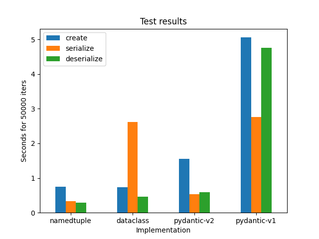

# container_bench

Inspired by this: https://janhendrikewers.uk/pydantic_vs_protobuf_vs_namedtuple_vs_dataclasses.html



Results:

| Impl          | create | serialize | deserialize |
|---------------|--------|-----------|-------------|
| NamedTuple    | 0.747  | 0.336     | 0.288       |
| Dataclass     | 0.737  | 2.62      | 0.465       |
| Pydantic (v1) | 5.06   | 2.76      | 4.76        |
| Pydantic (v2) | 1.56   | 0.531     | 0.594       |

Output (pydantic-v1 run):

```
sys.getsizeof(coords)=48
NTCoords(coords=[NTCoord(x=80, y=82, z=40, heading=19), NTCoord(x=36, y=85, z=91, heading=23), NTCoord(x=57, y=16, z=28, heading=47), NTCoord(x=14, y=9, z=11, heading=24), NTCoord(x=24, y=62, z=7, heading=84), NTCoord(x=83, y=45, z=66, heading=45), NTCoord(x=41, y=56, z=96, heading=95), NTCoord(x=6, y=69, z=94, heading=20), NTCoord(x=65, y=83, z=17, heading=61), NTCoord(x=44, y=11, z=69, heading=2), NTCoord(x=4, y=47, z=92, heading=75), NTCoord(x=56, y=37, z=3, heading=82), NTCoord(x=52, y=13, z=34, heading=78), NTCoord(x=16, y=71, z=35, heading=87), NTCoord(x=59, y=1, z=17, heading=79)])
NTCoords(coords=[NTCoord(x=80, y=82, z=40, heading=19), NTCoord(x=36, y=85, z=91, heading=23), NTCoord(x=57, y=16, z=28, heading=47), NTCoord(x=14, y=9, z=11, heading=24), NTCoord(x=24, y=62, z=7, heading=84), NTCoord(x=83, y=45, z=66, heading=45), NTCoord(x=41, y=56, z=96, heading=95), NTCoord(x=6, y=69, z=94, heading=20), NTCoord(x=65, y=83, z=17, heading=61), NTCoord(x=44, y=11, z=69, heading=2), NTCoord(x=4, y=47, z=92, heading=75), NTCoord(x=56, y=37, z=3, heading=82), NTCoord(x=52, y=13, z=34, heading=78), NTCoord(x=16, y=71, z=35, heading=87), NTCoord(x=59, y=1, z=17, heading=79)])
namedtuple - create: 0.747 total, 1.49e-05 avg
namedtuple - serialize: 0.336 total, 6.73e-06 avg
namedtuple - deserialize: 0.288 total, 5.76e-06 avg

sys.getsizeof(coords)=56
DCCoords(coords=[DCCoord(x=80, y=82, z=40, heading=19), DCCoord(x=36, y=85, z=91, heading=23), DCCoord(x=57, y=16, z=28, heading=47), DCCoord(x=14, y=9, z=11, heading=24), DCCoord(x=24, y=62, z=7, heading=84), DCCoord(x=83, y=45, z=66, heading=45), DCCoord(x=41, y=56, z=96, heading=95), DCCoord(x=6, y=69, z=94, heading=20), DCCoord(x=65, y=83, z=17, heading=61), DCCoord(x=44, y=11, z=69, heading=2), DCCoord(x=4, y=47, z=92, heading=75), DCCoord(x=56, y=37, z=3, heading=82), DCCoord(x=52, y=13, z=34, heading=78), DCCoord(x=16, y=71, z=35, heading=87), DCCoord(x=59, y=1, z=17, heading=79)])
DCCoords(coords=[DCCoord(x=80, y=82, z=40, heading=19), DCCoord(x=36, y=85, z=91, heading=23), DCCoord(x=57, y=16, z=28, heading=47), DCCoord(x=14, y=9, z=11, heading=24), DCCoord(x=24, y=62, z=7, heading=84), DCCoord(x=83, y=45, z=66, heading=45), DCCoord(x=41, y=56, z=96, heading=95), DCCoord(x=6, y=69, z=94, heading=20), DCCoord(x=65, y=83, z=17, heading=61), DCCoord(x=44, y=11, z=69, heading=2), DCCoord(x=4, y=47, z=92, heading=75), DCCoord(x=56, y=37, z=3, heading=82), DCCoord(x=52, y=13, z=34, heading=78), DCCoord(x=16, y=71, z=35, heading=87), DCCoord(x=59, y=1, z=17, heading=79)])
dataclass - create: 0.737 total, 1.47e-05 avg
dataclass - serialize: 2.62 total, 5.24e-05 avg
dataclass - deserialize: 0.465 total, 9.3e-06 avg

sys.getsizeof(coords)=56
PDCoords(coords=[PDCoord(x=80, y=82, z=40, heading=19), PDCoord(x=36, y=85, z=91, heading=23), PDCoord(x=57, y=16, z=28, heading=47), PDCoord(x=14, y=9, z=11, heading=24), PDCoord(x=24, y=62, z=7, heading=84), PDCoord(x=83, y=45, z=66, heading=45), PDCoord(x=41, y=56, z=96, heading=95), PDCoord(x=6, y=69, z=94, heading=20), PDCoord(x=65, y=83, z=17, heading=61), PDCoord(x=44, y=11, z=69, heading=2), PDCoord(x=4, y=47, z=92, heading=75), PDCoord(x=56, y=37, z=3, heading=82), PDCoord(x=52, y=13, z=34, heading=78), PDCoord(x=16, y=71, z=35, heading=87), PDCoord(x=59, y=1, z=17, heading=79)])
coords=[PDCoord(x=80, y=82, z=40, heading=19), PDCoord(x=36, y=85, z=91, heading=23), PDCoord(x=57, y=16, z=28, heading=47), PDCoord(x=14, y=9, z=11, heading=24), PDCoord(x=24, y=62, z=7, heading=84), PDCoord(x=83, y=45, z=66, heading=45), PDCoord(x=41, y=56, z=96, heading=95), PDCoord(x=6, y=69, z=94, heading=20), PDCoord(x=65, y=83, z=17, heading=61), PDCoord(x=44, y=11, z=69, heading=2), PDCoord(x=4, y=47, z=92, heading=75), PDCoord(x=56, y=37, z=3, heading=82), PDCoord(x=52, y=13, z=34, heading=78), PDCoord(x=16, y=71, z=35, heading=87), PDCoord(x=59, y=1, z=17, heading=79)]
pydantic-v1 - create: 5.06 total, 0.000101 avg
pydantic-v1 - serialize: 2.76 total, 5.53e-05 avg
pydantic-v1 - deserialize: 4.76 total, 9.52e-05 avg
```
